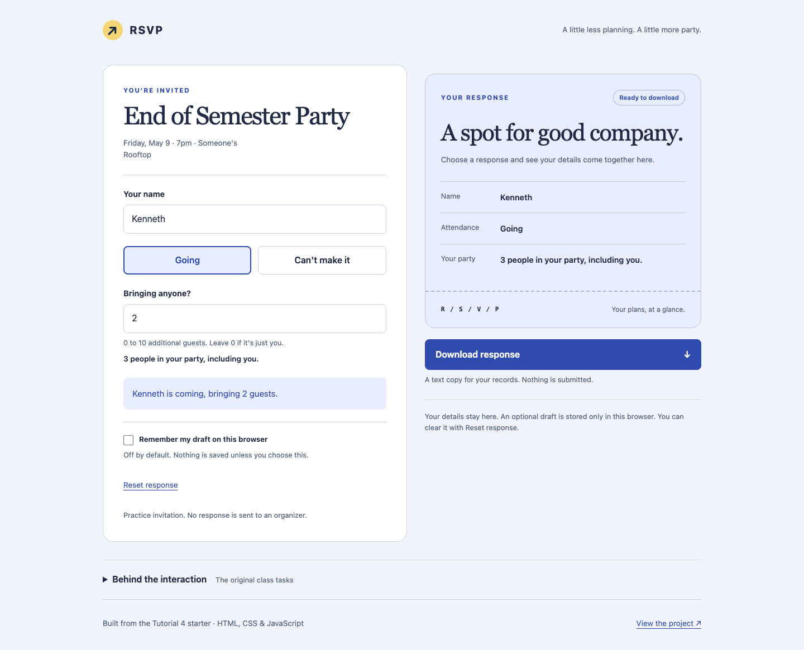
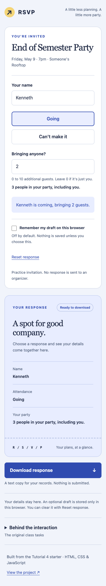

<p align="center">
  
</p>

<p align="center">
  <strong>A small JavaScript exercise, extended into a complete interaction.</strong><br>
  Choose a response, bring a guest, save a draft, and change your mind.
</p>


<p align="center">
  <a href="https://kennethyeaher.github.io/addingJava/tutorial_4_files/"></a>
  <a href="https://github.com/kennethyeaher/addingJava/actions/workflows/browser-checks.yml"></a>
  
</p>

<p align="center">
  <a href="https://kennethyeaher.github.io/addingJava/tutorial_4_files/"><strong>Try the card ↗</strong></a> &nbsp; · &nbsp;
  <a href="#class-requirements">Class requirements</a> &nbsp; · &nbsp;
  <a href="#run-locally">Run locally</a> &nbsp; · &nbsp;
  <a href="#verification">Verification</a>
</p>

---

## The interaction

An INST630 project built from the supplied Tutorial 4 starter. The required DOM interactions remain at the center: exclusive attendance choices, a conditional guest field, and messages that update as someone types. The extensions explore what happens after the happy path: an invalid count, an interrupted response, an accidental reset, or unavailable browser storage.



<details>
<summary><strong>See the mobile layout</strong></summary>
<br>
<p align="center"></p>
</details>

## Beyond the brief

| Extension | What it does | What the implementation demonstrates |
| --- | --- | --- |
| **Optional saved drafts** | Restores the name, choice, and guest count after a reload | Explicit storage consent, versioned data, schema checks, and failure handling |
| **Reset with Undo** | Clears the response and saved draft, then offers one recovery step | State snapshots, predictable transitions, and recovery from mistakes |
| **Downloadable response** | Exports a valid attendance response as a text file | Blob creation, temporary URL cleanup, and validation before an action |
| **Live response summary** | Reflects the current choice and party total | Consistent rendering from shared state |
| **Accessible feedback** | Exposes button state, errors, and response changes | Native controls, `aria-pressed`, status regions, keyboard focus, and reduced motion |
| **Repeatable browser checks** | Exercises the class criteria and added features on each push | Isolated browser contexts, failure cases, responsive checks, and continuous integration |

**Boundaries are deliberate.** This is a practice invitation, not an event registration service. No response is sent to an organizer. Saving is off by default. If enabled, the draft stays in that browser's local storage until saving is turned off or the response is reset. Undo is available until the next edit or reload. There is no account, server database, or attendance count across people.

## A short walkthrough

Open the card and choose **Going** to reveal the guest field. Change the response and watch the summary update. Try an invalid guest count, then correct it using the inline guidance. The optional draft and reset recovery flows are useful places to inspect how the interface handles interrupted input.

The implementation and browser checks are linked below; the screenshots show selected states rather than every possible interaction.

## Class requirements

Every submission criterion is preserved in [`script.js`](tutorial_4_files/script.js) and covered by [`tests/rsvp.test.cjs`](tests/rsvp.test.cjs).

| Submission criterion | Where to look |
| --- | --- |
| Only one Going / Can't make it button is active | `chooseGoing()`, `chooseNotGoing()`, and `updateResponse()` |
| Guest count appears only after Going | `guestField.classList.toggle('hidden', !isGoing)` |
| Confirmation or regret includes the person's name | `getName()`, `updateConfirmation()`, and `updateRegret()` |
| Text updates while typing | `input` listeners on the name and guest fields |
| Contemporary DOM selection and events | `document.querySelector()` and `addEventListener()` |

The exercise's learning goals are also visible directly in the code:

- **Boolean:** `isGoing` and `isNotGoing` track attendance. Both are false initially and after a reset.
- **String:** `.value`, `.trim()`, template literals, and `textContent` build safe, readable messages.
- **Number:** `Number(guestInput.value)` converts the guest count before comparisons and addition.
- **CSS classes:** `classList.add()`, `remove()`, and `toggle()` update visibility and selected states.

The original class instructions remain on the page under **Behind the interaction**. The original starter files are preserved in the first commit. The blank-name fallback remains `Someone`, and guest counts use separate wording for zero, one, and multiple guests.

## Run locally

**To use the card:** open `tutorial_4_files/index.html` directly, or use VS Code's Live Server. No installation or build is needed for the application. Use a local server for consistent draft storage behavior across browsers:

```sh
python3 -m http.server 8000
```

Open **[localhost:8000/tutorial_4_files/](http://localhost:8000/tutorial_4_files/)**.

**To run the checks:** use Node.js 22 or newer. Playwright is a development dependency only.

```sh
npm ci
npx playwright install chromium
npm run check
npm test
```

The test suite starts and stops its own local server. To use an installed Chrome browser instead:

```sh
BROWSER_CHANNEL=chrome npm test
```

## Verification

Ten browser tests cover the behavior below. The badge at the top links to the current hosted result.

| Coverage | Cases |
| --- | --- |
| Assignment behavior | Initial state, exclusive choices, live names, guest visibility, 0 / 1 / many guests, boolean / string / number types |
| Input safety | Blank and whitespace names, literal markup, empty / negative / fractional / excessive guest counts |
| Draft lifecycle | Opt in, reload, opt out, invalid stored data, blocked storage |
| Recovery | Reset, saved-data removal, Undo, cancellation of Undo after another edit |
| Downloads | Correct file name and content for attending and declining; unavailable for invalid or unselected responses |
| Accessibility and layout | Keyboard operation, accessible selection states, 320–1440 px widths, expanded task panel, 200% text, forced colors, reduced motion, JavaScript-disabled notice |

Local checks ran in Chrome. GitHub Actions runs the same suite in Chromium. Desktop and mobile screenshots are actual browser captures. Automated checks do not establish full accessibility conformance; Safari, Firefox, and VoiceOver have not been tested.

<details>
<summary><strong>A quick manual walkthrough</strong></summary>

1. Type a name and select Going. Only Going should be active.
2. Change the guest count to 0, 1, and 3. Check the wording and party total.
3. Enter -1, 1.5, 11, or an empty count. Check the error and disabled download.
4. Choose Can't make it, then change the name. The regret text should update.
5. Enable Remember my draft and reload. Check that the response returns.
6. Reset the response, then choose Undo reset. Check that the previous response returns.
7. Download the response and read the text file.
8. Repeat the core flow with Tab, Enter, and Space.

`checkStatus()` returns current values and types in the browser console. `resetCard()` resets the same state as the visible Reset response button.

</details>

## Project structure

```text
addingJava/
├── tutorial_4_files/
│   ├── index.html             # structure and original class tasks
│   ├── style.css              # layout, states, and responsive rules
│   └── script.js              # interactions, drafts, recovery, and export
├── tests/rsvp.test.cjs        # browser behavior checks
├── .github/workflows/        # hosted verification
├── docs/assets/              # banner and actual interface screenshots
└── package.json              # development checks only
```

## Design decisions

The response summary borrows the structure of a detachable invitation: shared colors, a clear information hierarchy, and a perforated divider. A serif event heading gives the invitation character; system text keeps the controls readable. The original event details remain unchanged.

The interaction follows ideas from *Designing Interfaces: Patterns for Effective Interaction Design*, 3rd edition, by Jenifer Tidwell, Charles Brewer, and Aynne Valencia:

- **Progressive Disclosure:** reveal the guest field only when attending. The supplied PDF discusses revealing relevant steps on PDF page 168.
- **Good Defaults and Smart Prefills:** start additional guests at zero. The pattern is explained on PDF page 795.
- **Input Hints and Error Messages:** put the allowed range beside the field and explain how to correct an invalid value.

PDF page positions are listed because they differ from printed page numbers. The optional draft and Undo features extend the exercise without adding a framework or changing its basic HTML, CSS, and JavaScript separation.

## Source and submission

The starter HTML, CSS, event details, task wording, and initial JavaScript scaffold come from the course's `tutorial_4_files.zip`. The assignment also references the [in-class CodePen demo](https://codepen.io/Alex-Leitch/pen/MYjWxdZ).

**Submission link:** [kennethyeaher.github.io/addingJava/tutorial_4_files/](https://kennethyeaher.github.io/addingJava/tutorial_4_files/)

---

## Author

**Kenneth Yeaher**  
MS in Human Computer Interaction  
University of Maryland, College Park  
[](https://www.linkedin.com/in/kennethyeaher/)

`JavaScript` · `Interaction Design` · `HTML and CSS`
